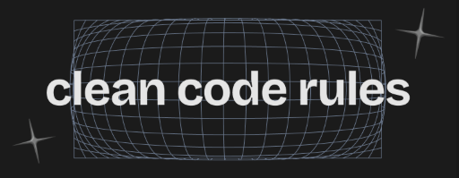

<style>
	* {
		width: 100%;
			text-align: start;
	}
	.controls{
		width: auto;
		text-align: end;
	}
	h1 {
		position: absolute;
		top: 0px;
		left: 0px;
		font-size: 24px !important;
		
	}
	h2 {
		font-size: 48px !important;
		font-weight: light;
	}
	
	p, li {
		font-size: 32px;
	}
</style>

## More on CSS

- Flexbox fundamentals
- Position elements with flexbox
- Practice: **Clean Code Rules**

---

**What is Flexbox?** A powerful CSS layout method for modern web design
Flexbox (Flexible Box Layout) provides an efficient way to arrange, distribute, and align items in a container

```css
.container {
  display: flex;
}
```

<!-- element class="fragment" -->

**Key Benefits:**

<!-- element class="fragment" -->

- One-dimensional layout (row or column)
- Dynamic sizing and alignment
- Responsive without media queries

<!-- element class="fragment" -->

---

**Flexbox Terminology** Understanding the core concepts

```css
.flex-container {
  display: flex; /* Creates flex container */
}

.flex-item {
  /* Child elements become flex items */
}
```

**Main Axis vs Cross Axis:**

- Main axis: Primary direction (default: horizontal) <!-- element class="fragment" -->
- Cross axis: Perpendicular to main axis (default: vertical) <!-- element class="fragment" -->

---

**Creating a Flex Container** The foundation of all flexbox layouts

```css
.container {
  display: flex;

  /* Optional: Set direction */
  flex-direction: row; /* default */
  flex-direction: column;
  flex-direction: row-reverse;
  flex-direction: column-reverse;
}
```

```html
<div class="container">
  <div class="item">Item 1</div>
  <div class="item">Item 2</div>
  <div class="item">Item 3</div>
</div>
```

---

**Flex Direction Control** Choosing your layout orientation

```css {hl_lines=[7,8]}
/* Horizontal layout (default) */
.horizontal {
  display: flex;
  flex-direction: row;
}

/* Vertical layout */
.vertical {
  display: flex;
  flex-direction: column;
}
```

**Pro Tip:** Direction affects which axis is "main" and which is "cross"

---

**Justify Content** Controlling alignment along the main axis

```css
.container {
  display: flex;
  justify-content: flex-start; /* default */
  justify-content: flex-end; /* align to end */
  justify-content: center; /* center items */
  justify-content: space-between; /* distribute evenly */
  justify-content: space-around; /* equal space around */
  justify-content: space-evenly; /* equal space everywhere */
}
```

---

**Align Items** Controlling alignment along the cross axis

```css
.container {
  display: flex;
  align-items: stretch; /* default - fill container */
  align-items: flex-start; /* align to top/left */
  align-items: flex-end; /* align to bottom/right */
  align-items: center; /* center vertically */
  align-items: baseline; /* align text baselines */
}
```

---

**Flex Wrap** Handling overflow and responsive behavior

```css
.container {
  display: flex;
  flex-wrap: nowrap; /* default - single line */
  flex-wrap: wrap; /* allow wrapping */
  flex-wrap: wrap-reverse; /* wrap in reverse order */
}

/* Shorthand */
.container {
  display: flex;
  flex-flow: row wrap; /* direction + wrap */
}
```

---

**Flex Item Properties** Controlling individual item behavior

```css
.flex-item {
  flex-grow: 1; /* grow to fill space */
  flex-shrink: 1; /* shrink when needed */
  flex-basis: auto; /* initial size */

  /* Shorthand */
  flex: 1 1 auto; /* grow shrink basis */
  flex: 1; /* common: equal distribution */
}
```

```css
.special-item {
  align-self: center; /* override container's align-items */
}
```

---

## Project

![[clean-code-rules.png]]
Note: ⚠️ This should be live coded with the students, use this as an opportunity to Q&A to validate students learning?

---

## Steps

- Header
- Main
- Footer

---

# Header

## 

# Header

What is the Html Structrure?

```html
<header>
  <h1>Clean Code Rules</h1>
</header>
```

---

# Header

What class names should we use?

- We are styling the Header, simply "header" makes sense <!-- element class="fragment" -->
- For the title we can use "header-title" <!-- element class="fragment" -->

---

# Header

**What styles/attributes do we need**?

- background & background-image <!-- element class="fragment" -->
- Font Styles <!-- element class="fragment" -->

---

# Main
