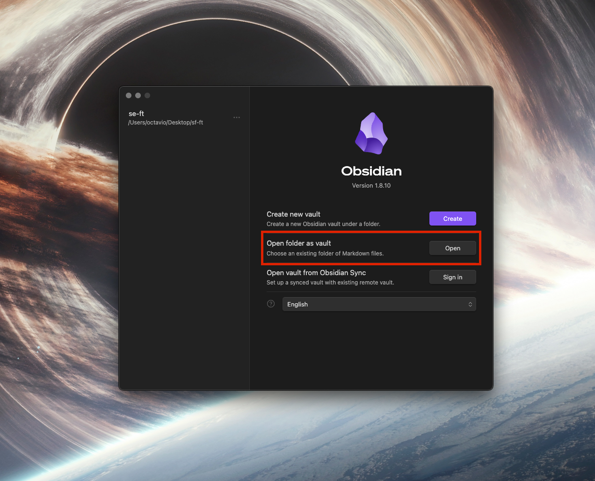
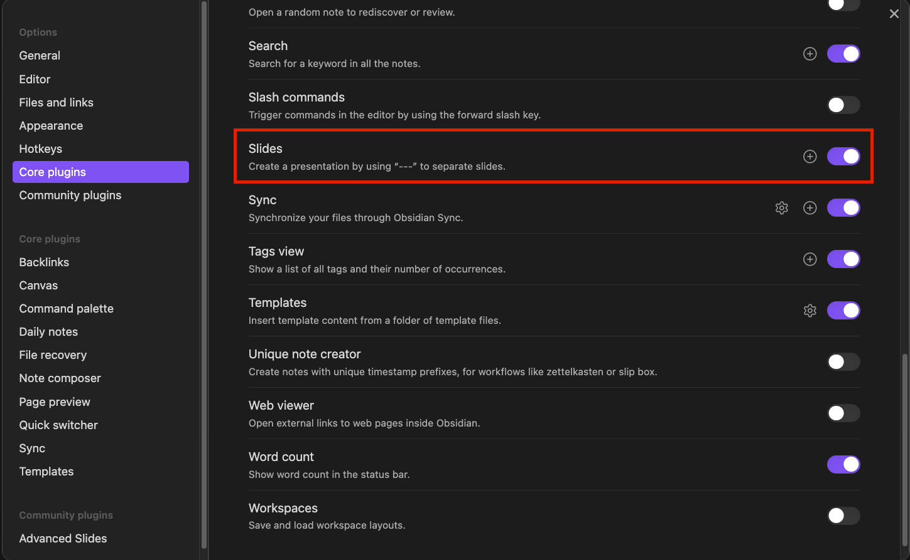
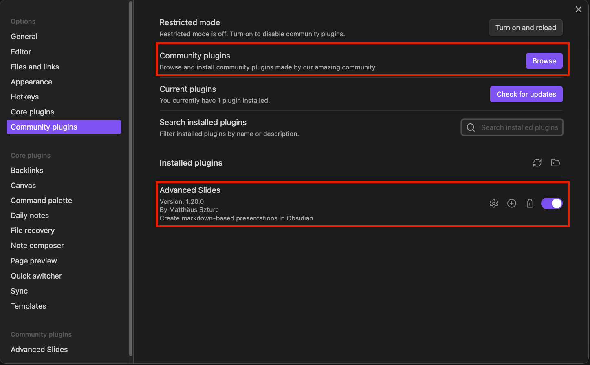

## Index

- [Instructor]
  - [Common links](./Instructor/Links.md)
  - [Workflow](./Instructor/Workflow.md)
- Sprint Lectures
  - [Sprint-0](./Lectures/Sprint-0/Sprint-0)
  - [Sprint-1](./Lectures/Sprint-1/Sprint-1)

## Get Started

First clone the github repository:

> https://github.com/olara-tripleten/se-ft-vault

- Open the repository folder as an Obsidian Vault
  
- Enable Slides Core Plugin
  

- Install and enable Advanced Slides Plugin
  
