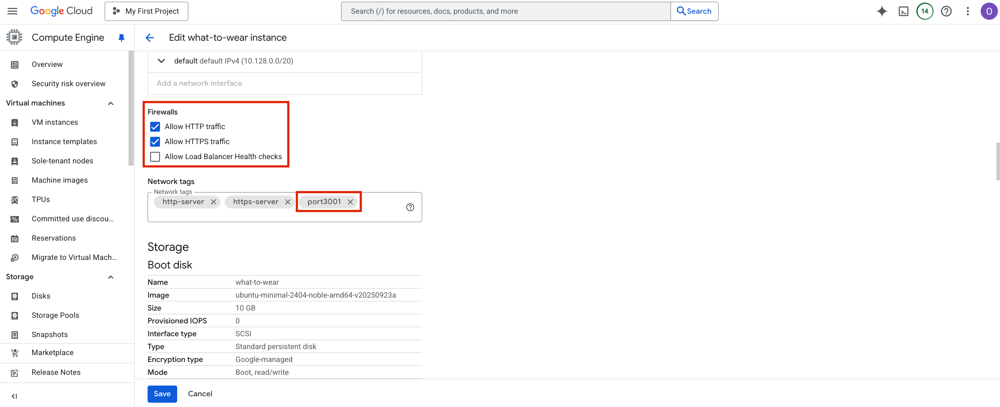
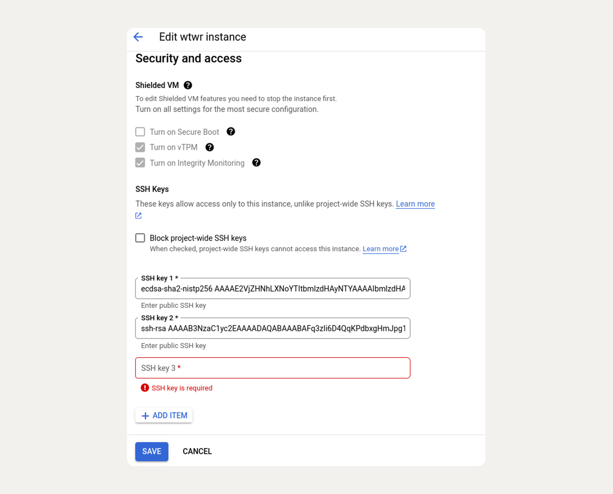
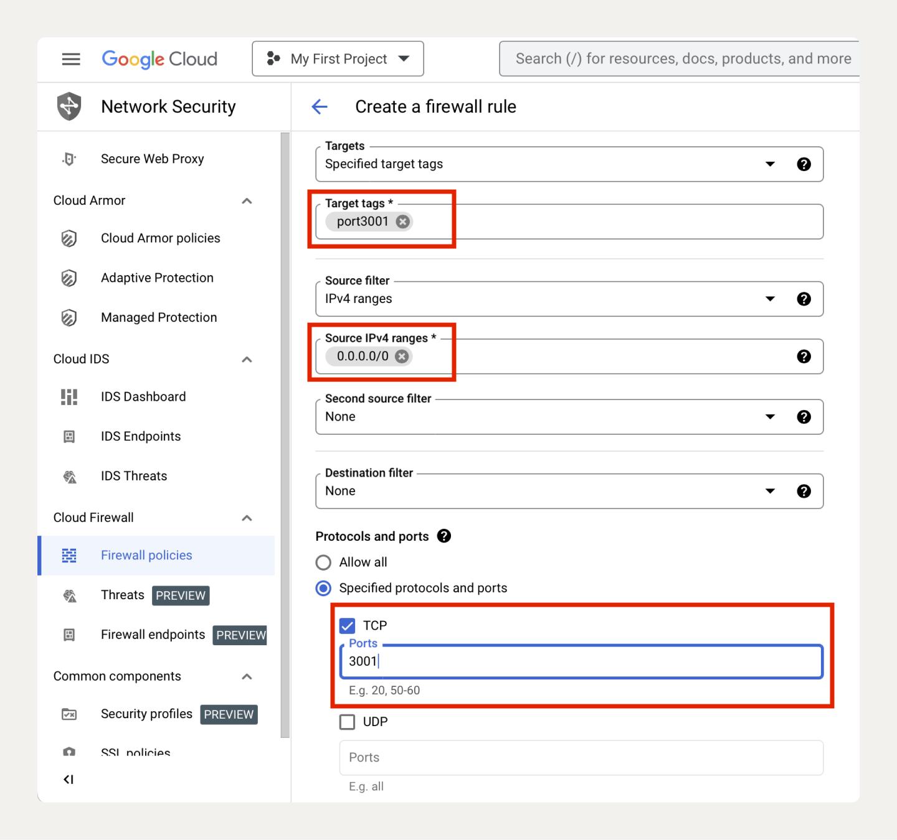
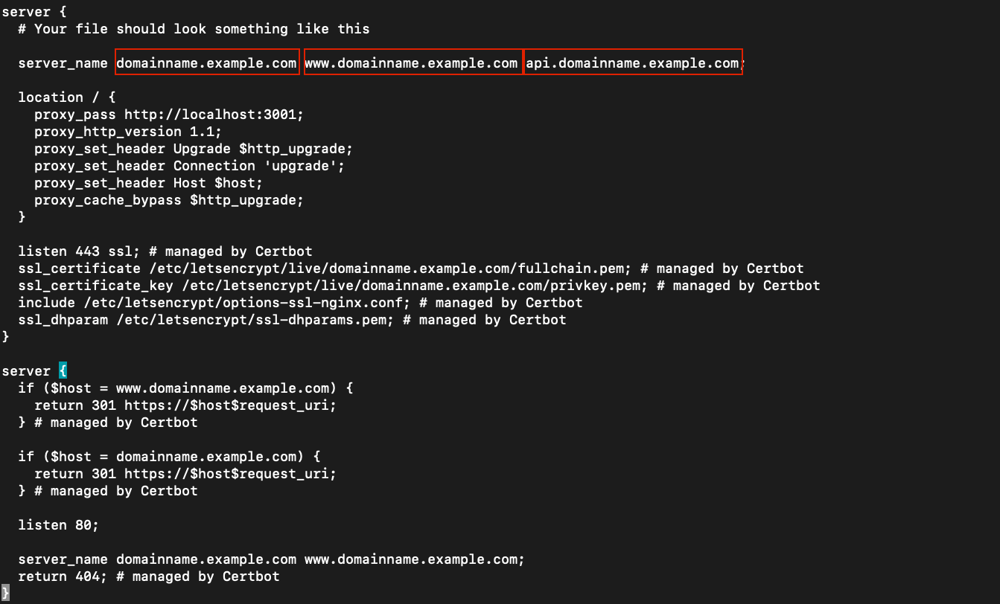
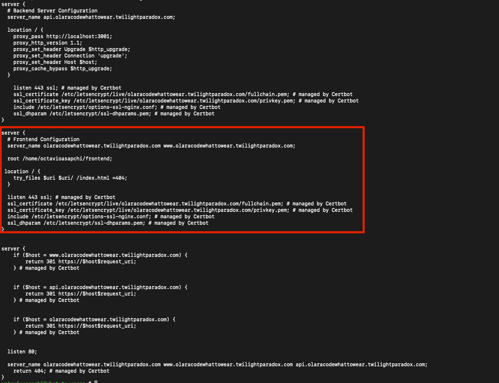

# Deployment Debugging Guide

## First Steps

Identify which step of a given deployment process caused an error. This guide is divided into the following sections:

- [VM Instance Setup](#vm-instance)
- [PM2 Configuration](#pm2)
- [Nginx & Certbot](#nginx--certbot)
- [Frontend Deployment](#frontend)

---

## VM Instance

**References:**
- [Chapter: Create a Remote Server](https://tripleten.com/trainer/web-ft/lesson/f7154372-5e20-4f69-a078-184a30a803ec/?from=program)
- [Chapter: Making the Server Ready to Use](https://tripleten.com/trainer/web-ft/lesson/8a6394dd-a6b3-4761-a795-fae66f5b2d6e/)

Common mistakes on the VM instance include incorrect port configuration or SSH connection issues.

To verify the setup, navigate to the VM Instance on Google Cloud and follow these steps:

1.  Click **Edit VM instance**.
2.  Scroll to the **Firewall** section and ensure the following are checked:
    - Allow HTTP traffic
    - Allow HTTPS traffic
3.  In the **Network Tags** section, confirm the presence of the custom `port3001` tag.

    

4.  Check that the required SSH key has been added to the instance.

    

5.  If the settings above are correct, verify that the custom Firewall rule was created according to specifications. You can check this in the [GCP Firewall Rules](https://console.cloud.google.com/networking/firewalls/list) console.

    Look for the `port-3001` rule and verify the following:
    - **Target Tags**: The name matches the tag used in the VM's firewall section.
    - **Source IPv4 Ranges**: `0.0.0.0/0`
    - **TCP Ports**: `3001`

    

---

## PM2

**Reference:**
- [Chapter: How to Keep an Application Continuously Running with PM2](https://tripleten.com/trainer/web-ft/lesson/e5839815-51ed-4642-a721-0085462a93b1/)

Check the application logs using `sudo pm2 logs`.

Common issues include:
- Dependencies not being installed correctly.
- Code changes that were not tested properly, leading to common debugging errors.

After making any changes to the backend code, run the following commands on the VM instance:
```sh
# Navigate to the project directory
cd se_project_express

# Pull the latest changes
git pull

# Restart the application with PM2
pm2 restart app
```

If errors persist, restarting the PM2 process might resolve the issue:
```sh
# Kill the PM2 process
pm2 kill

# Navigate to the project directory
cd se_project_express

# Start the application again
pm2 start app
```

---

## Nginx & Certbot

**References:**
- [Chapter: Registering a Subdomain](https://tripleten.com/trainer/web-ft/lesson/e9e75352-e0a9-4640-bf67-5f12c8df6526/)
- [Chapter: Configuring Port with nginx](https://tripleten.com/trainer/web-ft/lesson/1edfa4f3-bac2-48b2-af6c-2253bac1cb48/?from=program)
- [Chapter: Encrypting Data with HTTPS, SSL, and Certbot](https://tripleten.com/trainer/web-ft/lesson/4ff048c9-206d-427a-bcab-6e2ea3d2e220/?from=program)

Test the Nginx configuration for syntax errors and then reload it to apply changes.
```sh
# Test Nginx configuration
sudo nginx -t

# Reload Nginx
sudo systemctl reload nginx
```

Common errors with Nginx and Certbot are related to:
1.  **Incorrect Nginx Setup**: Ensure the correct domain name is used consistently throughout the configuration files.
2.  **Domain Name Mismatch**: The domain name used in the Nginx configuration must exactly match the one registered with FreeDNS.

To inspect the Nginx configuration file, run `sudo cat /etc/nginx/sites-available/default`. See the reference image below:


---

## Frontend

**Reference:**
- [Deploying Your Frontend to the Server](https://tripleten.com/trainer/web-ft/lesson/0699acad-e270-4fe9-8a18-b232afc3ab0c/?fromprogram)

First, check that the `frontend` folder exists on the VM.
1.  SSH into the VM.
2.  Run `ls`. You should see two folders: `se_project_express` and `frontend`.
3.  If the `frontend` folder does not exist, verify that the student has updated the `deploy` script in their `package.json` to the following:
    ```sh
    npm run build && scp -r ./dist/* google-user@Free-DNS.com:/home/google-user/frontend
    ```

### Troubleshooting a 404 Error

If you encounter a 404 error when navigating to the domain, follow these steps:

1.  **Check the Nginx Configuration**
    Ensure the Nginx file was updated correctly.
    ```sh
    sudo cat /etc/nginx/sites-available/default
    ```
    It should resemble the following example:
    

2.  **Verify Server Name**
    Check that the `server_name` directive is using the correct domain from FreeDNS.

3.  **Verify Document Root**
    The `root` directive should point to the correct frontend directory, e.g., `/home/GOOGLE_USER/frontend`.

4.  **Verify Location Block**
    The `location /` block should be configured as follows to handle single-page applications correctly:
    ```nginx
    location / {
      try_files $uri $uri/ /index.html =404;
    }
    ```

5.  **Check Nginx Logs**
    Examine the Nginx error logs for more details.
    ```sh
    sudo tail -n 50 /var/log/nginx/error.log
    ```
    - If you see a "Permission denied" error, run the following commands to adjust directory permissions:
      ```sh
      sudo chmod -R 755 /home/username/frontend
      sudo chmod 755 /home/username
      ```
    - After adjusting permissions, test and restart Nginx:
      ```sh
      sudo nginx -t
      sudo systemctl reload nginx
      ```